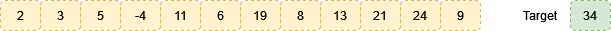

# Two Number Sum

Given an array of integers & a target value (integer), find 2 numbers that sum to a target value
eg. given

01 - The first algorithm has O(n2) performance due to the nested _for_ loop

02 - The second algorithm has O(n) performance; although the hashtable provides constant time loopkup, we need to iterate through all the values (worst case) to determine a match

03 - The third algorithm has O(n log n) performance
