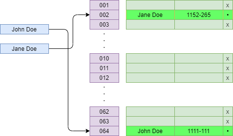
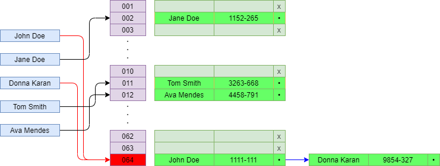
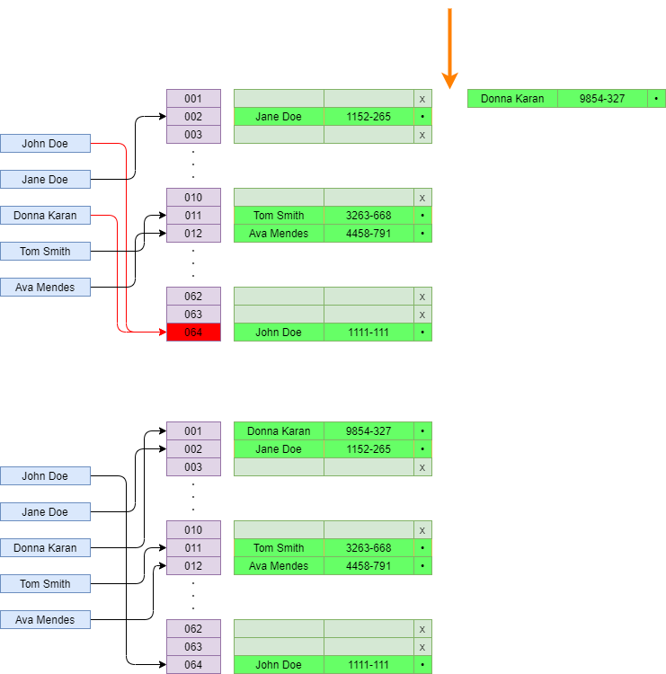
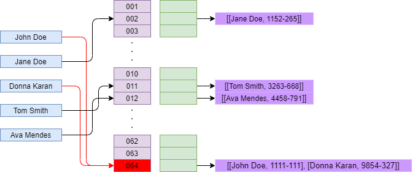

# Hash Tables

An item to be entered into a hash table would pass through a hashing function.
This would provide a hash (pointer) to the item to be stored, as below

Items entered into a hash table would have a O(1) lookup.

# Handling Collisions

It is possible that, multiple items would end up with the same hash; in this instance, we have a collision.
There are quite a few ways that this can be resolved; here we briefly go over
- Linked Lists
- Linear Probing
- Separate Chaining

## Linked Lists

In order to resolve multiple entries at a single location, one method that can be used is linked lists

## Linear Probing

Another method that can be used is Linear Probing where, when a collision is encountered, the item to be added is slotted into the next available spot in the hash table, as below

## Separate Chaining

Another method that can be used is Separate Chaining where, when a collision is encountered, the items to be added are pushed into an array, as below

