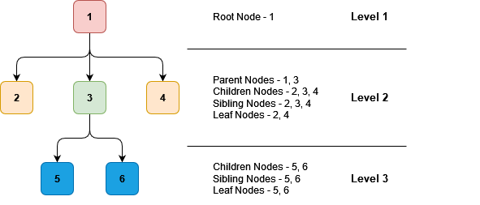
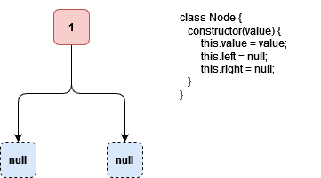

# Trees

Trees can be thought of as Nodes, connected as follows

The root node is at the start of the tree & has no parent.
In this particular example, root has 3 children, as indicated at level 2.
All the nodes at level 2 are siblings to each other (at this level); ie. child nodes of the same parent are siblings.
Node 3 is parent to nodes 5, 6.

A node that has no children is referred to as a Leaf Node.

A node can be represented syntactically as follows

## Binary Trees

A binary tree has nodes that contain a maximum of 2 child nodes.

## Binary Search Trees

A binary search tree has all the entries ordered; ie. all items in the tree to the left of root will have values less than root & all items in the tree to the right of root will have values greater than root.
