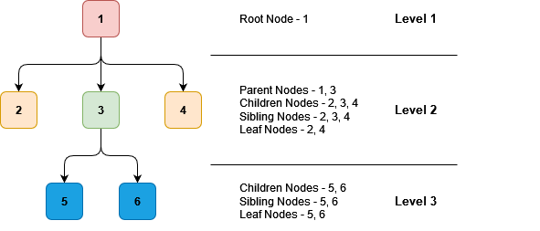

# Trees

Trees can be thought of as Nodes, connected as follows

The root node is at the start of the tree & has no parent.
In this particular example, root has 3 children, as indicated at level 2. All the nodes at level 2 are siblings to each other (at this level).
Node 3 is parent to nodes 5, 6.

A node that has no children is referred to as a Leaf Node.
