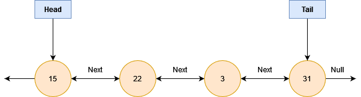
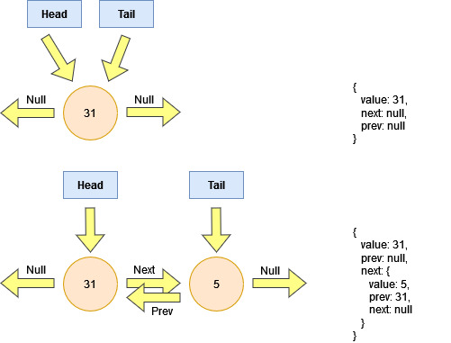

# Doubly Linked List

A doubly linked list, similar to a linked list, is a data structure that does not occupy a contiguous area of memory.
Where this differs from the singly linked list is that every node has a _next pointer_ & a _previous pointer_.

Similar to the singly linked list, the first node has an attribute called _head_ & the last node will have an attribute called _tail_; the representation below illustrates this

Conceptually, this translates into the following object in code

