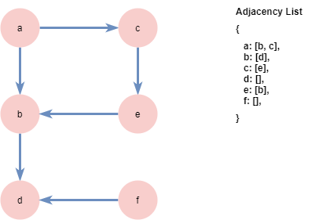

# Graph

A graph is a collection of nodes & edges, as below.
We can visualize the graph with nodes as circles & the edges as lines connecting the circles.

In a directed graph, you can only move between nodes in the direction as indicated by the arrowheads.
In an undirect graph, you can travel in any direction.

In a directed graph, if you're at node A, then your neighbours are nodes B & C (as below)

If you're at node C however, then your only neighbour is E

The graph from above can be represented in code by a hashmap type data structure, as below

# Graph Traversal

In order to move within a graph, we can do depth first traversal or breadth first traversal.
For the graph below, if we started at node A, then (for a depth first search) we would have 
a -> b -> d

If we again started at node A, but did a breadth first search (& assuming we selected node B as the first neighbour), we would have
a -> b -> c 

A depth first traversal uses a stack.
A breadth first traversal uses a queue.