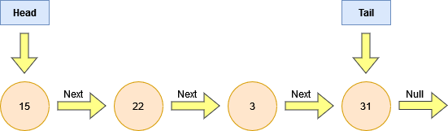
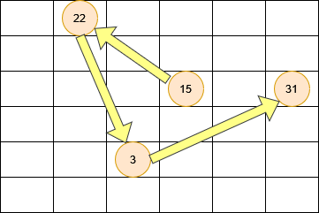
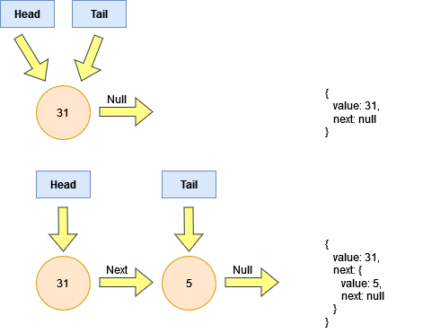

# Linked List

A linked list is a data structure that does not occupy a contiguous area of memory, ie. they can be spread apart with a pointer that points to the next entry in the linked list.
It can be thought of as having a node, with a _next_ pointer.
The first node has an attribute called _head_ & the last node will have an attribute called _tail_; the representation below illustrates this

In this instance, we are looking at a singly-linked list, ie. the next pointers all point forward only.
In memory, the linked list will look similar to this

Conceptually, this translates into the following object in code

