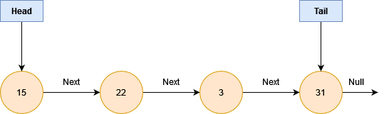
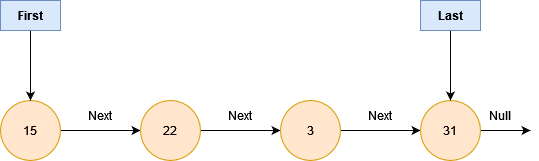

# Queue

A queue is a linear data structure with first in first out (FIFO) order of operation.
Looking at the singly linked list below

We could alter this; ie. we rename _head_ to _first_ & we can rename _tail_ to _last_.
This looks very much like a singly linked list & we can conceptualize what a queue looks like, as below

A queue has enqueue & dequeue operations.
Enqueue - adding an entry into the queue
Dequeue - removing an entry from the queue
If we enqueue at the end of the queue & dequeue from the beginning of the queue, they both become O(1) operations.
