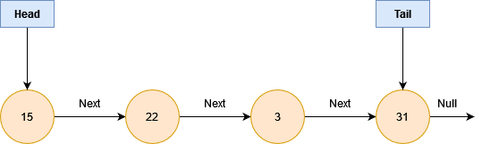
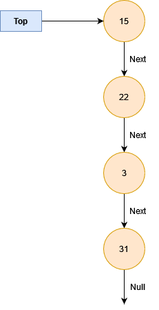

# Stack

A stack is a linear data structure with last in first out order of operation.
Looking at the singly linked list below

We could alter this; ie. we rename _head_ to _top_. we no longer require a tail, so this can be removed.
And if we change it to look like below, we can conceptualize what a stack looks like.

